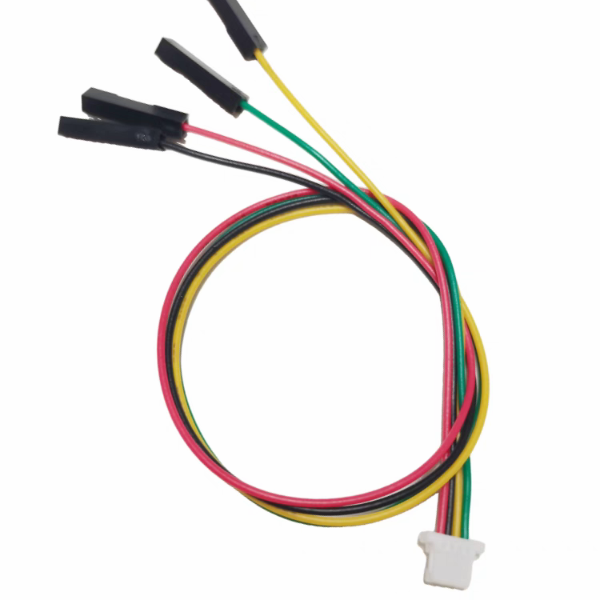

# KCNVrmModTool

> 一个用于解锁服务器VRM功率墙(破解大功率CPU)的通用工具。

<h4 style="color:red; text-align:center;"> 
警告: 破解大功率存在风险，包括可能失去原厂保修及潜在的硬件损坏风险。请三思而后行。对于造成的任何后果，开发者不承担任何责任。
</h4>

## 刷写教程
> 以下教程仅包含部分机型命令。不同机型需要使用不同的命令，混用命令会导致VRM控制器损坏。

1. 购买 **MCP2221a** 开发板及 **JST-SH 1.0 4pin 转杜邦母头** 转换线材。

| MCP2221a 开发板 | 转换线材 |
|-----------------|---------|
|  |  |

2. 安装 **[MCP2221a 驱动 (点击下载)](https://ww1.microchip.com/downloads/aemDocuments/documents/OTH/ProductDocuments/SoftwareLibraries/Firmware/MCP2221_Windows_Driver_2021-02-22.zip)** 及 **[本程序 (点击前往最新 Releases 处)](https://github.com/JDDKCN/KCNVrmModTool/releases)** 。

3. 将服务器断电。找到位于 **主板靠风扇侧** 的丝印标识为 **2C0_PWR** 的 **VRM控制器 3针刷写公头**：
   - 以主板上印有**小箭头**的对应针脚定义为**主板第一针脚**
   - 以开发板母座**左侧**开始的针脚定义为**开发板第一针脚**
   - 依次插上 **`黑` `红` `绿`** 的杜邦线
   - 若线材与图片不一致，请按以下对应关系连接：
     - `开发板母座第一针脚` → `主板第三针脚`
     - `开发板母座第二针脚` → `不连接`
     - `开发板母座第三针脚` → `主板第一针脚`
     - `开发板母座第四针脚` → `主板第二针脚`
       
> - 上述连接步骤以浪潮 SA5212M5 为例，不同机型连接方法可能不同。

4. 连接3完成后，将机器上电。不要开机，等待服务器 BMC 加载完毕。

5. 此时开始刷写VRM。在本程序根目录下运行cmd，依次输入执行：
   ```bash
   :: 第一步命令，通用
   KCNVrmModTool -scan 20 7f 

   :: 以下为不同机型的第二步命令
   KCNVrmModTool -PXE1610C 40 42 :: 浪潮 SA5112M5/SA5212M5
   KCNVrmModTool -TPS53679 58 60 :: 超微 X11DPL/X11DPLH
   KCNVrmModTool -MP2955A 20 21 :: 超微 X11SPM/X11DPi
   KCNVrmModTool -PXE1610C 50 52 :: 超微 X11DPU
   KCNVrmModTool -PXE1610C 28 38 :: 英特尔 S2600WF
   KCNVrmModTool -PXE1610C 30 38 :: 英特尔 S2600BP
   KCNVrmModTool -PXE1610C 60 62 :: 戴尔 7820/7920 工作站
   ```
   即刷写完毕。

> 若以上机型中没有适用于您机器的型号：
> 
> - 将第一步中程序搜索出来的VRM控制器与地址 **`顺序`** 构建命令：
>
> - **KCNVrmModTool -[VRM控制器型号] [第1个扫描出的数字地址] [第2个扫描出的数字地址]**
>
> - 将构建好的命令输入CMD执行即可。
>
> 程序搜索出地址的示例如下： `Probably [VRM控制器型号] found at addr [扫描出的数字地址]` 。

6. 刷写完毕后，断电再开机。机器功率墙解锁完毕。

## 工作原理

**KCNVrmModTool** 通过修改服务器主板上 **VRM(电压调节模块)控制器** 的参数来解除功率限制。具体原理如下：

1. **通信桥接**: 
   - 本工具使用MCP2221a USB转I²C设备作为通信桥，连接计算机与服务器主板上的VRM控制器。I²C是一种低速主从通信协议，专为芯片间通信设计。

2. **VRM功率墙机制**:
   - 服务器主板上的VRM控制器 (如PXE1610C、TPS53679等) 负责将主电源转换为CPU所需的精确电压，这些控制器内置了功率限制参数 (IccMax) 以防止硬件过载。厂商通常将这些参数设置得较为保守，以确保系统稳定性和延长硬件寿命。

3. **VRM修改逻辑**:
   - 工具首先通过`-scan`命令扫描I²C总线，定位VRM控制器的地址，然后使用特定命令 (如`-PXE1610C`等) 向控制器发送指令，修改控制器内部的IccMax寄存器值至最大 (0xFF) ，解除电流限制。

4. **VRM修改效果**:
   - 破解大功率后，CPU能够获得更大的供电能力。这可以让服务器支持更高功率的CPU型号，或使现有CPU在高负载情况下保持更高的工作频率。如浪潮SA5212M5破解大功率后支持功率从205w变为了255w，支持使用8259cl/8272cl/8275cl等大功率处理器。

## 免责声明
本项目仅供研究交流用，禁止用于商业及非法用途。使用本项目造成的事故与损失，与作者无关。本项目完全免费，如果您是花钱买的，说明您被骗了。请尽快退款，以减少您的损失。

## 其他平台
前往我的 [**B站主页**](https://space.bilibili.com/475547854/) : 剧毒的KCN

关注我的 [**Twitter账号**](https://twitter.com/2233KCN03) : @2233kcn03

加入我的 [**QQ交流群**](http://qm.qq.com/cgi-bin/qm/qr?_wv=1027&k=_-W8U_Mrz_nOu3eD_u3VGiPICKe9t7zY&authKey=rB2PW5mIrIY3ARjMqqWtw%2F2Qpejm5EArmuy95Wq1GfC7gLzUzTRATTnULKUKtb76&noverify=0&group_code=1140538395) : 1140538395
